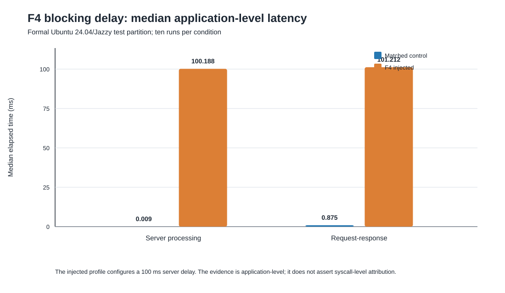

# RoboTraceOpt

RoboTraceOpt analyzes ROS 2 runtime behavior across application, middleware,
and Linux layers. It combines cross-layer tracing, evidence-graph diagnosis,
and constrained configuration optimization for robotic systems.

Explicit adapters unify application-level RuntimeEvent records, ROS 2 traces,
and Linux runtime evidence. The diagnosis layer builds typed evidence graphs,
reports uncertainty instead of forcing a root-cause label, and only allows
optimization trials whose actions match the diagnosed cause.

## What is included

- RuntimeEvent v2 instrumentation for three ROS 2 workloads.
- Adapters for RuntimeEvent, `ros2_tracing`, eBPF scheduling records, and
  SocketCAN/vcan ACK lifecycles.
- Topology-constrained trace-stage association and typed evidence graphs.
- Auditable root-cause inference with conflict handling and abstention.
- A bounded action registry and reproducible guided, random, and unguided
  search protocols.
- Candidate validation and offline rollback decisions.
- Balanced repeated campaigns with paired bootstrap confidence bounds.
- Development experiment runners for F1-F6 fault characterization.

## Repository layout

```text
ros2_core/     ROS 2 Humble packages and launch files
diagnosis/     evidence adapters, association, graph construction, inference
experiments/   fault catalog, controlled runners, matched comparisons
optimizer/     action constraints, search plans, objectives, validation
scripts/       build, capture, smoke, and experiment entry points
tests/         unit and contract tests
docs/          public schemas, environment notes, and migration references
```

## RDK X5 preparation

X5 setup, two-adapter physical CAN wiring, pilot execution, the short defense
demonstration, and recovery steps are documented in
[`docs/hardware/X5_RUNBOOK.md`](docs/hardware/X5_RUNBOOK.md). The required
capture artifacts, CANable/SLCAN branch, and claim boundaries are documented in
[`docs/hardware/PHYSICAL_CAN_EVIDENCE.md`](docs/hardware/PHYSICAL_CAN_EVIDENCE.md).

Preview package installation and run the read-only software preflight:

```bash
bash scripts/bootstrap_x5.sh --dry-run
python3 scripts/preflight_x5.py --mode software
```

With two UP physical CAN interfaces, rehearse the complete demonstration without
starting a workload:

```bash
python3 scripts/run_x5_demo.py \
  --dry-run \
  --runtime-interface can0 \
  --peer-interface can1 \
  --bitrate 500000 \
  --output-dir data/raw/demos/x5_plan_01
```

The current physical result is a two-interface SocketCAN smoke with a responder
peer. It is development evidence, not an ECU HIL result or a substitute for the
frozen native X5 tracing/eBPF matrix. A retained normal/drop pair with the
required capture artifacts is necessary before reporting an F6 diagnosis or
performance conclusion.

## Environment

The primary development environment is Ubuntu 22.04 with ROS 2 Humble. The
core workspace can be built from WSL or native Ubuntu:

```bash
bash scripts/build_core.sh
source ~/.cache/robotraceopt_build/install/setup.bash
```

Run the migrated workloads:

```bash
bash scripts/run_smoke_workload.sh all 8
```

Run the Python test suite:

```bash
python3 -m unittest discover -s tests -q
python3 -m unittest \
  tests.optimizer.test_action_registry \
  tests.optimizer.test_diagnosis_guided_sampler \
  tests.optimizer.test_runtime_objective \
  tests.optimizer.test_candidate_validator \
  tests.optimizer.test_rollback \
  tests.optimizer.test_trial_planner \
  tests.optimizer.test_runtime_trial \
  tests.optimizer.test_search_summary \
  tests.optimizer.test_diagnosis_gate \
  tests.optimizer.test_runtime_profiles \
  tests.optimizer.test_closed_loop \
  tests.optimizer.test_closed_loop_cli \
  tests.optimizer.test_campaign_schedule \
  tests.optimizer.test_paired_bootstrap \
  tests.optimizer.test_repeated_campaign_cli -q
```

## AI planner reliability

The AI planner supports explicit mock, OpenAI-compatible, and deterministic
replay backends through one versioned request/result contract. It records only
normalized decision evidence when configured, rejects stale/duplicate output,
and fails closed before the final CAN guard. Configuration, replay, fault
campaign semantics, and the distinction between command delivery and task
success are documented in
[docs/ai/OPENAI_COMPATIBLE_PROXY_SETUP.md](docs/ai/OPENAI_COMPATIBLE_PROXY_SETUP.md).

## Evidence boundaries

Generated raw and processed experiment data is intentionally excluded from
Git. Development evidence is kept separate from calibration and held-out test
partitions. RuntimeEvent-only and vcan results are labeled as proxy evidence
and are not presented as formal syscall, scheduler, or physical CAN
attribution. A `physical_can_evidence=true` capture establishes only the
recorded physical SocketCAN transport path; by itself it is not an ECU HIL,
functional-safety, actuator, or formal experiment result.

The repository contains implementation and public technical documentation
only. Private research documents and local experiment data are excluded.

## Native Linux F3/F4 formal results

The frozen Ubuntu 24.04 / ROS 2 Jazzy test partition completed 40/40 runs:
ten balanced control/injected pairs for F3 and ten for F4. The exact code used
by the session is retained at commit `384b215` and local archival tag
`experiment-native-f3f4-formal-v3-20260729`.

| Case | Control | Injected | Defensible conclusion |
| --- | ---: | ---: | --- |
| F3 scheduling pressure | 95.30% complete lifecycle recovery | 67.56% | Pressure reduces complete-path recovery; complete samples are selection-biased, so this is not scheduler-causality evidence. |
| F4 100 ms service blocking | 0.875 ms request-response median | 101.212 ms | The application-level blocking effect is recovered with a paired median increase of about 100.337 ms. |



The sanitized [native F3/F4 evidence package](docs/evidence/native-f3f4-formal-v3/)
contains qualification metadata, source hashes, run-level metrics, statistics,
and both result figures.

These runs establish native collection and the reported F3/F4 effects. They do
not yet establish held-out multi-class diagnosis accuracy, abstention quality,
runtime overhead, optimization benefit, ECU HIL behavior, or actuator safety.
Those claims require separate frozen datasets and paired campaigns.

## WSL2 run-held-out association evaluation

The earlier WSL2 / Ubuntu 22.04 / ROS 2 Humble overlap logs also support a
separate run-held-out evaluation of path association. Runs 01-05 calibrate the
timestamp baseline and runs 06-10 are held out for testing in each scenario.
The predictor receives only event identity, trace ID, sequence ID, stage, and
timestamp; oracle identity is joined only after public groups are generated.

| Held-out scenario | Oracle traces | `trace_id_contract` precision | Recall | F1 | Run-bootstrap 95% F1 CI |
| --- | ---: | ---: | ---: | ---: | ---: |
| Dual 10 Hz | 6,024 | 1.0000 | 0.9772 | 0.9884 | [0.9793, 0.9939] |
| Dual mixed-rate | 5,178 | 1.0000 | 1.0000 | 1.0000 | [1.0000, 1.0000] |

This is association and path-validity evidence, not F1-F6 root-cause
classification. The runs share one host and boot, use mock-mode delays, and
record a dirty source tree at commit `65273ea`; their input hashes and source
tree hash are retained. They are therefore reported separately from the clean,
native F3/F4 formal session and do not close the held-out diagnosis or formal
optimization gaps.

The complete sanitized [run-held-out association package](docs/evidence/wsl-heldout-association-20260731/)
includes the frozen evaluator, aggregate scoring outputs, split manifest, and
input-artifact hashes. Row-level predictions remain in the private audit copy.

## Limited supporting evidence

Two overlooked campaigns are now preserved with narrower claim boundaries:

- The [WSL2 RuntimeEvent proxy-overhead package](docs/evidence/wsl-runtimeevent-overhead-20260712/)
  contains 60 whole-run summaries: disabled, buffered, and per-event flush at
  nominal 5 Hz and stress 20 Hz. Median process CPU was 2.037%, 3.476%, and
  3.250% at 5 Hz, and 4.075%, 7.607%, and 7.253% at 20 Hz. This block-ordered,
  dirty-tree WSL2 campaign is not native or four-mode tracing/fused evidence.
- The [X5 physical-CAN smoke package](docs/evidence/x5-physical-can-smoke-20260727/)
  preserves one 40-second arm64 PREEMPT_RT capture with 34 sends, 34 matched
  ACKs, 100% payload matching, and 6.039 ms / 6.238 ms send-to-ACK P50/P95.
  The planner was mock and no drop/timeout comparator exists, so this is neither
  ECU HIL nor evidence for the current fail-closed model runtime.

See the [public evidence index](docs/evidence/) for package manifests and the
claim boundary of every published result.

## Project lineage

RoboTraceOpt consolidates engineering work from
[ROS2Probe](https://github.com/Quchaosheng/ROS2Probe) and
[RoboTraceRT](https://github.com/Quchaosheng/RoboTraceRT) into one maintained
codebase.
## Formal experiment readiness

The formal-session protocol freezes selected Chapter 6 cases before any ROS 2
process starts. Generate a read-only platform report after sourcing ROS 2 and
the built workspace:

```bash
python3 scripts/check_platform_capabilities.py \
  --label x86-wsl \
  --output-json data/raw/environment/x86-wsl.json
```

Current WSL development can rehearse only the cases whose reported
requirements are ready. This command writes a 42-run plan for F1, mock F6, and
the two optimization campaigns without starting a workload:

```bash
python3 scripts/run_formal_experiment_session.py \
  --matrix experiments/protocol/formal_experiment_matrix.json \
  --capability-report data/raw/environment/x86-wsl.json \
  --case diagnosis_f1_control \
  --case diagnosis_f1_injected \
  --case diagnosis_f6_control \
  --case diagnosis_f6_injected \
  --case optimization_executor \
  --case optimization_qos \
  --dataset-role pilot \
  --session-name readiness_dry_run_20260718_01 \
  --seed 20260718 \
  --output-dir data/raw/experiments/pilot/readiness_dry_run_20260718_01 \
  --dry-run
```

This dry-run does not contain measurement evidence. WSL is denied for
`calibration` and held-out `test` roles even when individual tools appear
available.

### Fault evidence commit point

A successful formal fault case writes `artifact_manifest.json` last. The
manifest names the required RuntimeEvent, run/oracle/command, identity,
tracing, eBPF, scheduler, and summary artifacts for that fault and records a
SHA-256 for every file or CTF directory. The outer session verifies this
manifest before accepting the case and revalidates its nested artifacts during
every integrity reconstruction. A missing or changed artifact makes the case
failed or the session invalid; it is preserved and is never silently replaced.

F3/F4 now invoke the eBPF collector during the workload window instead of only
checking that the tool is installed. Capture starts only when the live
`process-manifest/v2` reports `ebpf_identity_status=comparable`; the runner
does not match tasks by process name as a fallback. F2/F3/F5 perform a full ROS 2 trace export
after CTF capture, retaining every selected event rather
than the bounded sampling used by public fixtures.

This integration closes the evidence contract but does not establish X5 measurement results.
WSL dry-runs and synthetic tests remain readiness checks;
formal conclusions still require a qualified native Linux or X5 `test`
session with real artifacts.

On the actual X5, first generate a new report with `--label rdk-x5`. After the
report allows every selected requirement and Git is clean, the held-out entry
is:

```bash
python3 scripts/run_formal_experiment_session.py \
  --matrix experiments/protocol/formal_experiment_matrix.json \
  --capability-report data/raw/environment/rdk-x5.json \
  --case diagnosis_f1_injected \
  --case diagnosis_f2_injected \
  --case diagnosis_f3_injected \
  --case diagnosis_f4_injected \
  --case diagnosis_f6_injected \
  --dataset-role test \
  --session-name x5_test_01 \
  --seed 20260718 \
  --output-dir data/raw/experiments/test/x5_test_01
```

An interrupted session is continued with the same frozen arguments plus
`--resume`. Resume verifies the manifest sidecar, matrix, capability report,
Git commit, role, seed, and session name. Successful, failed, and interrupted
cases are terminal and are never rerun in place; a new measurement attempt
uses a new session name. Physical CAN is not part of this first formal matrix.
Control variants and F5 are intentionally excluded here because they remain
development-only until their formal evidence profiles are frozen.
